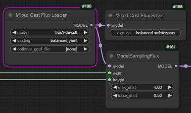

# Mixed Cast Flux Loader

With huge thanks and credit to city96's [GGUF loader](https://github.com/city96/ComfyUI-GGUF), upon which 
this node is heavily based, and much of whose code can be found herein...

## What is this?

This node allows you to load a normal FLUX model (the original, or a finetune) and cast it on the fly 
to a GGUF format (`Q8_0`, `Q5_1` or `Q4_1`) or a different torch format (eg `float8_e4m3fnuz`).

In addition, it allows you to cast different parts of the model to different formats, so that those
parts that are more sensitive can be kept at higher precision, and those that are less sensitive can 
be made smaller.

By default some parts of the model are always left in full precision (input layer, final layer, normalisations).

## Install or update

To install:

``` 
cd [your comfy directory]/custom_nodes
git clone https://github.com/ChrisGoringe/cg-mixed-casting
```

To update:

```
cd [your comfy directory]/custom_nodes/cg-mixed-casting
git pull
```

## Loading and casting a model

You'll find the loader node under `advanced/loaders`. 



- `model` The base FLUX model (one of so-called unet only ones)
- `casting` The casting scheme. See below for details.
- `optional_gguf_model` The pre-quantised GGUF model that you are patching from, if any

## Casting scheme

A casting scheme is a `.yaml` file that specifies what bits of the model get cast into what format. 
They live in the `configurations` subdirectory of the custom node's folder. There are few you can try:

- `bfloat8_plus` uses `float8_e4m3fnuz`, except for four of the 57 layers which are left at full precision
- `Q4_andabit` uses `Q4_1` except for the same four layers, again, they are left at full precision
- `balanced` uses `Q4_1`, `Q5_1`, `Q8_0` and full precision

There is also `example.yaml` which has very detailed instructions on how to make your own. 

## Patching

If you want to use a quantisation that isn't supported, you can do so by patching. This copies GGUF quantised
blocks from another model. It really should be a quantised version of the same model, like the the Flux
ones [here](https://huggingface.co/city96/FLUX.1-dev-gguf/tree/main).

Put the model in your unet directory, and select it in the `optional_gguf_file`. Then use the keyword `patch` in
the configuration file to use the block from the optional model.

See `patch_singles.yaml` for an example.

## Saving

If you find a configuration you like, you can save the mixed version of the file using the saver node, 
found under 'advanced/savers'.

Just give it a name, and it will be saved in the output directory. Move it to your `unet` directory, and
restart comfy server (and reload webpage), and it will appear in the loader node.

*Note that this does _not_ save LoRAs etc. that have been applied*

## Loading a premix

To load a premix just select it. The configuration file will be ignored.

## Enjoy!

And if you come up with a good casting scheme, let everyone know!

