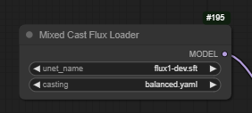

# Mixed Cast Flux Loader

With huge thanks and credit to city96's [GGUF loader](https://github.com/city96/ComfyUI-GGUF), upon which 
this node is heavily based, and much of whose code can be found herein...

## What is this?

This node allows you to load a normal FLUX model (the original, or a finetune) and cast it on the fly 
to a GGUF format (`Q8_0`, `Q5_1` or `Q4_1`) or a different torch format (eg `float8_e4m3fnuz`).

In addition, it allows you to cast different parts of the model to different formats, so that those
parts that are more sensitive can be kept at higher precision, and those that are less sensitive can 
be made smaller.

By default some parts of the model are always left in full precision (input layer, final layer, normalisations).

## How to use it

Install by doing `git clone https://github.com/ChrisGoringe/cg-mixed-casting` in your custom nodes directory.

You'll find the loader node under `advanced/loaders`.

Select the model, and the casting scheme (see below), and use it. Yes, it works with LoRAs (thanks again to city96's code!).

## Casting scheme

A casting scheme is a `.yaml` file that specifies what bits of the model get cast into what format. 
They live in the `configurations` subdirectory of the custom node's folder. There are few you can try:

- `bfloat8_plus` uses `float8_e4m3fnuz`, except for four of the 57 layers which are left at full precision
- `Q4_andabit` uses `Q4_1` except for the same four layers, again, they are left at full precision
- `balanced` uses `Q4_1`, `Q5_1`, `Q8_0` and full precision

There is also `example.yaml` which has very detailed instructions on how to make your own!

## Enjoy!

And if you come up with a good casting scheme, let everyone know!