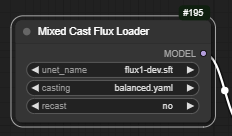
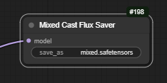
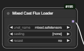

# Mixed Cast Flux Loader

With huge thanks and credit to city96's [GGUF loader](https://github.com/city96/ComfyUI-GGUF), upon which 
this node is heavily based, and much of whose code can be found herein...

## What is this?

This node allows you to load a normal FLUX model (the original, or a finetune) and cast it on the fly 
to a GGUF format (`Q8_0`, `Q5_1` or `Q4_1`) or a different torch format (eg `float8_e4m3fnuz`).

In addition, it allows you to cast different parts of the model to different formats, so that those
parts that are more sensitive can be kept at higher precision, and those that are less sensitive can 
be made smaller.

By default some parts of the model are always left in full precision (input layer, final layer, normalisations).

## Install or update

To install:

``` 
cd [your comfy directory]/custom_nodes
git clone https://github.com/ChrisGoringe/cg-mixed-casting
```

To update:

```
cd [your comfy directory]/custom_nodes/cg-mixed-casting
git pull
```

## Loading and casting a model

You'll find the loader node under `advanced/loaders`. 



Select the model you want to load, and the casting scheme (see below),
and use it. Yes, it works with LoRAs (thanks again to city96's code!).

Ignore `recast` for the time being!

## Casting scheme

A casting scheme is a `.yaml` file that specifies what bits of the model get cast into what format. 
They live in the `configurations` subdirectory of the custom node's folder. There are few you can try:

- `bfloat8_plus` uses `float8_e4m3fnuz`, except for four of the 57 layers which are left at full precision
- `Q4_andabit` uses `Q4_1` except for the same four layers, again, they are left at full precision
- `balanced` uses `Q4_1`, `Q5_1`, `Q8_0` and full precision

There is also `example.yaml` which has very detailed instructions on how to make your own. 

## Saving

If you find a configuration you like, you can save the mixed version of the file using the saver node, 
found under 'advanced/savers'



Just give it a name, and it will be saved in the output directory. Move it to your `unet` directory, and
restart comfy, and it will appear in the loader node (just like new checkpoints).

*Note that this does _not_ save LoRAs etc. that have been applied*

## Loading a premix

To load a premix and use it without applying any more casts, just select `[none]` for the casting. 



Note that the reported size of the model (in the console log) may be incorrect when reloading [bug #10](https://github.com/chrisgoringe/cg-mixed-casting/issues/10). This is provided for information only, so won't impact use.

## Recasting a premix

This is experimental, and there are lots of good reasons not to do it!

If you select a configuration file, you can use `recast` to decide what happens when a block that
has already been cast (in the premix) has a casting intruction in the configuration file. 

The default (recast set to `no`) is to ignore the configuration file for any blocks that have already been cast.

- if the premix has torch casts (like `float8_e4m3fnuz`), they will be recast regardless of the recast setting (this is [bug #9](https://github.com/chrisgoringe/cg-mixed-casting/issues/9))

If you set recast to `yes`, the blocks will be recast into the new format. However:

- it makes no sense to use this to recast to a more accurate format - the data has already been approximated
- recasting to a smaller format is less accurate than starting again (`full -> Q8_0 -> Q4_1` is worse than `full -> Q4_1`)

## Enjoy!

And if you come up with a good casting scheme, let everyone know!

[.](https://huggingface.co/city96/FLUX.1-dev-gguf/tree/main)